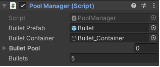

## Implementing Object Pooling

Here you will be walked through the steps in order to learn and visualize how you can implement object pooling in your project.

Below is the example of pooling the player bullets in a shooter game. 

As the initial step, we will make a pool manager script and will make it a Singleton so all other scripts can have easy access to it.

```csharp
private static PoolManager _instance;
public static PoolManager Instance
{
	get
			{
				if(_instance == null)
					{
						Debug.LogError("Pool Manager is Null");
					}
					return _instance;
			}
}
private void Awake()
{
	_instance = this;
}
```

Now make the object you want to pool as a prefab and give a reference to the same. Post that, create a list to hold the prefabs and a number variable to tell the game how many prefabs you want to instantiate.

 

```csharp
[SerializeField] private GameObject _bulletPrefab;
[SerializeField] private GameObject _bulletContainer;
[SerializeField] private List<GameObject> _bulletPool;
[SerializeField] private int _bullets;
```

Now we will create a method that will return our list. This method will take integer parameters, loop through the same & create a number of prefabs based on the integer provided. Once a bullet is instantiated it will be parented to the container and disabled. 

```csharp
private List<GameObject> GenerateBullets(int numOfBullets)
{
		for(int i=0; i < numOfBullets; i++)
		{
			GameObject bullet = Instantiate(_bulletPrefab);
			bullet.transform.parent = _bulletContainer.transform;
			bullet.SetActive(false);
			_bulletPool.Add(bullet);
		}
return _bulletPool;
}
```

Now as the above method is returning our list. We will set out a list to generate bullet method

```csharp
private void Start()
{
		_bulletPool = GenerateBullets(_bullets);
}
```

Now, in order to use existing bullet prefabs instead of creating new ones, we will create a public method to find an inactive bullet in the list and use it as the bullet that we are firing. In case of no inactive bullet, it will create one.

```csharp
public GameObject RequestBullet()
{
		foreach(var bullet in _bulletPool)
		{
			if(bullet.activeInHierarchy == false)
				{
					bullet.SetActive(true);
					return bullet;
				}
		}
			GameObject newbullet = Instantiate(_bulletPrefab);
			newbullet.transform.parent = _bulletContainer.transform;
			_bulletPool.Add(newbullet);
			return newbullet;
}
```

Below is a dummy player script for shooting bullets. Here you will see the call of Object Pooling in Fire method.

```csharp
public class Player: MonoBehaviour
{
		//dummy code to call Fire method in update
	private void Fire()
	{
		if(Input.GetKeyDown(KeyCode.Mouse))
			{
				GameObject bullet = PoolManager.Instance.RequestBullet()'
				bullet.transform.position = Vector3.zero;
			}
	}
}
```

Last but not the least, we will set our bullets inactive after a set amount of time. This is done using OnEnable and invoking a method that will do the same.

```csharp
public class Bullet: MonoBehaviour
{
	private float _speed = 20f;
	private void OnEnable()
{
		Invoke("Hide", 2f)
}
void Update()
{
	transform.Translate(Vector3.right * Time.deltaTime * _speed);
}
void Hide()
{
	this.gameObjetc.SetActive(false);
}
```

Switching back to Unity, make sure to set all references and the number of initial bullets you want. For example,



**Conclusion:** The above practice will allow your game to create a set amount of prefabs and recycle them instead of instantiating multiple prefabs. this will reduce the amount of garbage collection in your game and make it more efficient.
